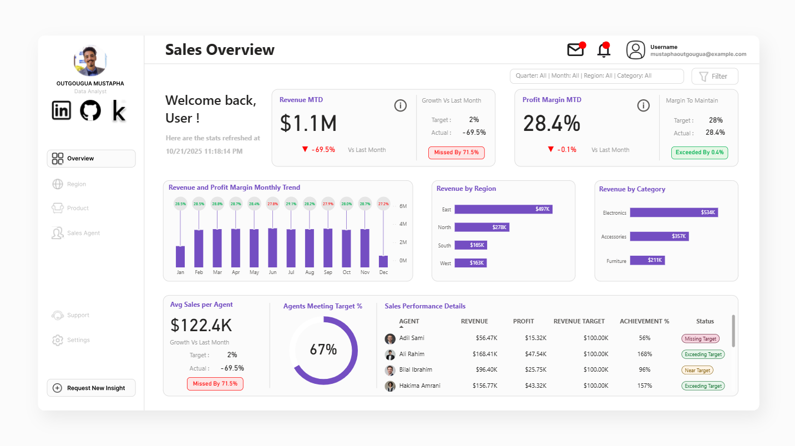

# Sales Overview Dashboard

This project is a comprehensive Sales Overview dashboard created to analyze and visualize key sales performance metrics. The dashboard provides a high-level (MTD Revenue, Profit Margin) and granular (per-agent, per-region) view of sales data, enabling stakeholders to make data-driven decisions, identify top-performing agents, and pinpoint areas for improvement.

## 📑 Table of Contents

- [Overview](#-dashboard-preview)
- [Project Objectives](#-project-objectives)
- [Key Features](#-key-features--insights)
- [Dashboard Metrics](#-dashboard-metrics)
- [Technology Stack](#%EF%B8%8F-technology-stack)
- [How to View](#-how-to-view)
- [Future Enhancements](#-future-enhancements)
- [Author](#-author)

---

## 📊 Dashboard Preview

-----

## 🎯 Project Objectives

  * **Track Key KPIs:** Monitor essential metrics like Month-to-Date (MTD) Revenue, Profit Margin, and their growth compared to the previous month and targets.
  * **Analyze Trends:** Visualize monthly trends for both revenue and profit margin to identify seasonal patterns or performance shifts.
  * **Segment Performance:** Break down revenue by geographical **Region** (East, West, North, South) and **Product Category** (Electronics, Accessories, Furniture).
  * **Evaluate Agent Performance:** Measure sales team effectiveness by tracking average sales per agent, the percentage of agents meeting their target, and a detailed performance breakdown for each agent.

-----

## ✨ Key Features & Insights

This dashboard consolidates complex sales data into one easy-to-understand interface:

  * **Executive KPIs:**

      * **Revenue MTD:** $1.1M (Missed target by 71.5%)
      * **Profit Margin MTD:** 28.4% (Exceeded target by 0.4%)

  * **Revenue & Profit Monthly Trend:**

      * A dual-axis chart shows monthly revenue trend (bar chart) against profit margin (Bubbles) from January to December, allowing for easy correlation analysis.

  * **Performance Segmentation:**

      * **Revenue by Region:** Identifies 'East' ($497K) as the top-performing region.
      * **Revenue by Category:** Shows 'Electronics' ($584K) as the highest-grossing category.

  * **Sales Team Performance:**

      * **Agents Meeting Target:** 67% of the sales team successfully met their sales quota.
      * **Avg Sales per Agent:** $122.4K.
      * **Detailed Agent Table:** A granular view of each agent's Revenue, Profit, Target, Achievement %, and performance **Status** (e.g., *Exceeding Target*, *Missing Target*, *Near Target*).

  * **Interactive Filters:**

      * The dashboard is fully interactive, with filters for **Quarter**, **Month**, **Region**, and **Category** to allow for deeper, customized analysis.

-----
## 📊 Dashboard Metrics

### Performance Indicators
- **Month-to-Date (MTD) Revenue**: Current month's cumulative revenue
- **Profit Margin %**: Ratio of net profit to revenue
- **Target Achievement %**: Performance against set sales goals
- **Regional Revenue Distribution**: Sales breakdown by geographic region
- **Category Performance**: Revenue contribution by product category

-----

## 🛠️ Technology Stack

| Component | Technology |
|-----------|------------|
| **Visualization Platform** | Microsoft Power BI |
| **Data Source** | Excel (.xlsx) |
| **Data Transformation** | Power Query |
| **Data Modeling** | DAX (Data Analysis Expressions) |

-----
## 🚀 How to View

### Interactive Dashboard

Experience the live dashboard with full interactivity:

**[➡️ View Live Dashboard](https://app.powerbi.com/view?r=eyJrIjoiMjBmYTFjYWItODI3Yy00YWM2LTljNjItYmNjNjliNzA5MGY4IiwidCI6Ijg0ZDI3MGQyLTBiYzUtNGQ1NS1iZjBhLTI3NGYxYTU3NmNiZiJ9)**

### Dashboard Features
- **Interactive Filters**: Click on any visual element to filter the entire dashboard
- **Cross-filtering**: Select regions, categories, or time periods to update all metrics
- **Drill-through**: Access detailed information by interacting with specific data points
- **Export Options**: Download visuals and data for presentations or reports

-----

## 🔮 Future Enhancements

This dashboard represents the "Overview" page of a comprehensive sales analytics solution. Planned expansions include:

### 📍 Region Page
- Detailed regional performance analysis with geographic visualizations
- Regional trend comparisons and growth patterns
- Top-performing territories and sales distribution within regions
- Market penetration analysis by region

### 📦 Product Page
- Product-level profitability and margin analysis
- Category and sub-category deep dives
- Inventory turnover and product performance metrics
- Best-selling products and underperforming SKUs
- Product mix optimization insights

### 👥 Sales Agent Page
- Comprehensive individual performance scorecards
- Historical performance trends and growth tracking
- Customer relationship and account management metrics
- Product mix and category expertise by agent
- Commission and incentive calculations
- Performance rankings and peer comparisons

### Additional Analytics Features
- Predictive analytics for sales forecasting
- Year-over-year comparison analysis
- Customer segmentation and behavior patterns
- Automated insights and anomaly detection

-----

## 💼 About This Project

This dashboard showcases advanced data analysis and visualization capabilities in Power BI, demonstrating:

- **Data Modeling**: Efficient data structure design for optimal performance
- **DAX Proficiency**: Complex calculations for KPIs and metrics
- **Visual Design**: Clean, intuitive, and professional dashboard layout
- **Business Intelligence**: Translation of raw data into actionable insights
- **User Experience**: Interactive elements that enhance data exploration

The project highlights skills in data transformation, business analytics, and creating executive-level reporting solutions.

---

## 👤 Author

**OUTGOUGUA MUSTAPHA**

Data Analyst | Power BI Developer | Business Intelligence Specialist

- 💼 [LinkedIn](https://www.linkedin.com/in/mustapha-outgougua/)
- 🐙 [GitHub](https://github.com/outgouguamustapha)
- 📧 Open to collaboration and opportunities

---

**If you found this project insightful, please consider giving it a ⭐!**

Made with ❤️ and Power BI

